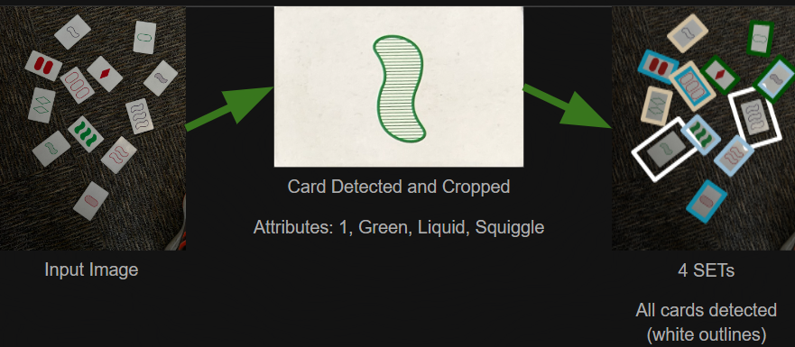

Set Finder is a new tool for playing the game Set. Simply take a picture of the board, and Set Finder will highlight any sets that are on the board at the moment. 

## Why use Set Finder?
- Test your skills
- Speed up games by quickly checking if more cards are needed
- Quickly teach others the rules of Set
- Easy to use
- Detects all possible sets

[View the project demo](https://www.youtube.com/watch?v=N0XaY0yACYI)

## How to Use
- Clone [the repository](https://github.com/olincollege/set-finder) to your computer
- Install dependencies by running `pip install -r requirements.txt` and `sudo apt-get install python3-pil.imagetk`
- Run `view.py` to start
- Select the image of your set game

## About Us
Created by [Ari Bobesh](https://github.com/AriB2003), [Venkadesh Eswaranandam](https://github.com/TinyTinfoil), and [Rebecca Flach](https://github.com/RebeccaFlach).
This project was created at Olin College of Engineering as a final project for the class Software Design. 

## APIs Used
- [OpenCV](https://opencv.org/) for image recognition
- [Matplotlib](https://matplotlib.org/) for display
- [NumPy](https://numpy.org/) for internal data management
- [pytest](https://docs.pytest.org/en/7.3.x/contents.html) for unit testing. 
- [Pillow](https://pypi.org/project/Pillow/) for image display.